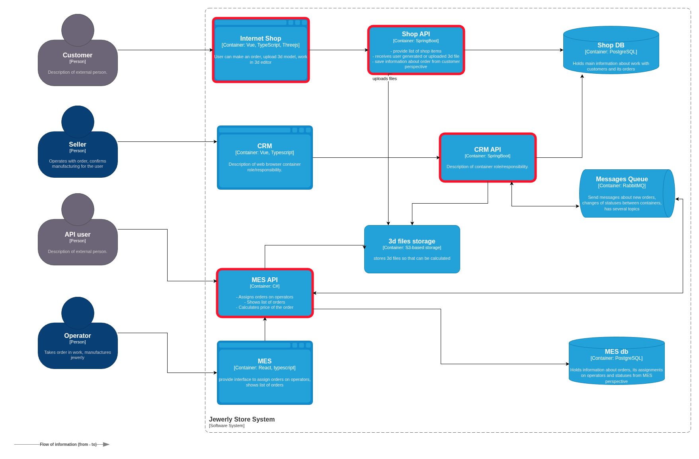
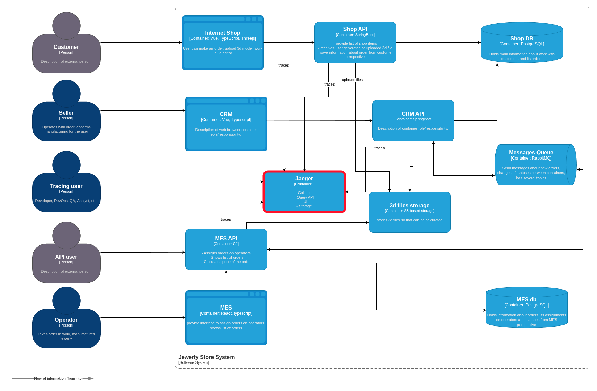

# Трейсинг

## Покрытие трейсингом
Все сервисы, входящие в состав Александрита будут участвовать. Это потребует разного количества изменений, в зависимости от роли, которую будет выполнять сервис. Рассмотри эти изменения.

**Участие в трассировке**
- Internet Shop:
    - генерация нового trace_id и корневого span_id, с него все начинается;
    - хранение и добавление trace_id при новых операция для того же заказа (выгрузка 3D-модели);
    - коннект к сборщику для передачи трейсов.
- Shop API, CRM API, MES API:
    - передача trace_id другим сервисам;
    - генерация span_id для новых шагов в обработке заказа (сохранение в Б и S3);
    - коннект к сборщику для передачи трейсов.
- Shop DB, MES DB:
    - хранение trace_id и span_id.
- S3 storage, Messages Queue:
    - сквозная передача trace_id и span_id для 3D-модели и сообщений.
- CRM, MES:
    - сквозная передача trace_id и span_id для заказов.

На схеме будем считать, что сервисы, которые занимаются сквозной передачей и хранением принимают пассивное участие в трейсинге. Активными (выделены красной рамкой) будем считать те, которые отправляют трейсы сборщику. Так как трейсы SQL запросов отправляются из инициирующих приложений с помощью специальных экспортеров, будем считать что роль БД ограничена хранением метаданных трейсов.
Александрит C4 containers: .

В таблице ниже описаны данные, участвующие в трейсинге на примере use-case-а успешного выполнения заказа с загрузкой 3D-модели. Выбран этот сценарий так как он затрагивает все компоненты системы. Другие use-cas-ы являются его подмножествами с точки зрения трассировочного покрытия.

**Данные трейсов**
Обозначения:
- ts - timestamp

Предполагается, что trace_id и span_id передаются в каждом трейсе.

| Источник | Приемник | Тип запроса | trace_id | span_id | Данные в трейсе | Комментарий |
|---|---|---|---|---|---|---|
|||| INITIATED |||||
| Internet Shop | Shop API      | HTTP     | XXX | 1  | ts, user_id, {order_data}           | Создание заказа пользователем |
| Shop API      | Shop DB       | SQL      | XXX | 2  | ts, order_id, order_status          | Сохранение в БД |
|||| FILE_UPLOADED |||||
| Internet Shop | Shop API      | HTTP     | XXX | 3  | ts, order_id, file_id, order_status | Загрузка файлов модели пользователем |
| Shop API      | S3            | API call | XXX | 4  | ts, file_id, order_id               | Сохранение модели в S3 |
| S3            | MES API       | API call | XXX | 5  | ts, file_id, order_id               | Получение моделей для оценки |
|||| PRICE_CALCULATED |||||
| MES API       | MES DB        | SQL      | XXX | 6  | ts, file_id, order_id, order_status | Сохранение оцененной модели в MES DB |
| MES API       | Message Queue | RMQ msg  | XXX | 7  | ts, order_id, order_status          | Сообщение об успешной оценке заказа |
| CRM API       | Shop DB       | SQL      | XXX | 8  | ts, order_id, order_status          | Изменение статуса заказа в Shop DB |
| CRM           | CRM API       | HTTP     | XXX | 8  |                                     | Запрос неподтвержденных заказов продавцом |
|||| MANUFACTURING_APPROVED |||||
| CRM           | CRM API       | HTTP     | XXX | 9  | ts, order_id, order_status          | Производство подтверждено продавцом |
| CRM API       | Shop DB       | SQL      | XXX | 10 | ts, order_id, order_status          | Изменение статуса заказа в Shop DB |
| CRM API       | Message Queue | RMQ msg  | XXX | 11 | ts, order_id, order_status          | Сообщение о подтверждении продавцом |
| MES API       | MES DB        | SQL      | XXX | 12 | ts, order_id, order_status          | Изменение статуса заказа в MES DB |
| MES           | MES API       | HTTP     | XXX | 12 |                                     | Оператор запросил список подтвержденных заказов |
|||| MANUFACTURING_STARTED |||||
| MES           | MES API       | HTTP     | XXX | 12 | ts, order_id, order_status          | Оператор взял заказ в работу |
| MES API       | MES DB        | SQL      | XXX | 13 | ts, order_id, order_status          | Изменение статуса заказа в MES DB |
| MES API       | Message Queue | RMQ msg  | XXX | 14 | ts, order_id, order_status          | Сообщение о взятии заказа в работу |
| CRM API       | Shop DB       | SQL      | XXX | 15 | ts, order_id, order_status          | Изменение статуса заказа в Shop DB |
|||| MANUFACTURING_COMPLETED |||||
| MES           | MES API       | HTTP     | XXX | 16 | ts, order_id, order_status          | Оператор завершил заказ |
| MES API       | MES DB        | SQL      | XXX | 17 | ts, order_id, order_status          | Изменение статуса заказа в MES DB |
| MES API       | Message Queue | RMQ msg  | XXX | 18 | ts, order_id, order_status          | Сообщение о завершил заказа |
| CRM API       | Shop DB       | SQL      | XXX | 19 | ts, order_id, order_status          | Изменение статуса заказа в Shop DB |
|||| PACKAGING |||||
| MES           | MES API       | HTTP     | XXX | 20 | ts, order_id, order_status          | Оператор начал упаковывать заказ |
| MES API       | MES DB        | SQL      | XXX | 21 | ts, order_id, order_status          | Изменение статуса заказа в MES DB |
| MES API       | Message Queue | RMQ msg  | XXX | 22 | ts, order_id, order_status          | Сообщение о начале упаковки заказа |
| CRM API       | Shop DB       | SQL      | XXX | 23 | ts, order_id, order_status          | Изменение статуса заказа в Shop DB |
|||| SHIPPED |||||
| MES           | MES API       | HTTP     | XXX | 24 | ts, order_id, order_status          | Оператор отправил заказ покупателю |
| MES API       | MES DB        | SQL      | XXX | 25 | ts, order_id, order_status          | Изменение статуса заказа в MES DB |
| MES API       | Message Queue | RMQ msg  | XXX | 26 | ts, order_id, order_status          | Сообщение об отправке |
| CRM API       | Shop DB       | SQL      | XXX | 27 | ts, order_id, order_status          | Изменение статуса заказа в Shop DB |
| CRM           | CRM API       | HTTP     | XXX | 27 |                                     | Запрос на доставленные заказы для закрытия |
|||| CLOSED |||||
| CRM           | CRM API       | HTTP     | XXX | 28 | ts, order_id, order_status          | Закрытие заказа |
| CRM API       | Shop DB       | SQL      | XXX | 29 | ts, order_id, order_status          | Изменение статуса заказа в Shop DB |
| CRM API       | Message Queue | RMQ msg  | XXX | 30 | ts, order_id, order_status          | Сообщение о закрытии заказа |
| MES API       | MES DB        | SQL      | XXX | 31 | ts, order_id, order_status          | Изменение статуса заказа в MES DB |

## Мотивация
Ни один IT-продукт не обходится без ошибок. Это реальность, с которой нам приходится мириться. Но мы можем уменьшить их число, если будем использовать проверенные решения и лучшие практики. Мы можем повлиять не только на число ошибок, но и на время их исправления. Конечно, нам никогда не удастся свести его к нулю, но день лучше, чем неделя, а час лучше, чем день!
Одним из способов уменьшения времени исправления является трейсинг. Он, подобно следопыту, умеющему выследить цель, способен отделить конкретный рабочий процесс от сотен других, одновременно происходящих в системе, и предоставить его подробности для анализа. Мы сможем не просто увидеть результат: запрос не прошел, но и понять на каком именно шаге это случилось и какова была причина.

Трейсы помогут решить следующие проблемы компании:
- установить точную причину потери заказов за счет возможности отследить путь запроса в систем;
- быстрее исправлять ошибки, в том числе найденные на стадии тестирования, что значительно сократит задержки релизов;
- улучшить производительность запросов к MES за счет встроенных инструментов анализа производительности.

Кроме того, трейсинг способен повысить эффективность E2E-тестирования:
- позволяет не просто проверить выполнена ли операция,но проследить весь путь и проверить статус на каждом этапе;
- избавляет от необходимости проверять успешность операций в отдельных сервисах, предоставляя всю информацию в ответе;
- облегчает тестирование асинхронных операций, давай возможность проверить лишь трейс в ответе.

Можно отметить пользу трейсинга для разработки:
- снижается трудоемкость поиска проблемных месте как при тестировании, так и при отладке новых фичей;
- способствует взаимопониманию между командами за счет большей прозрачности системы.

Метрики, на которые трейсы влияют позитивно:
- Бизнес
    - Успешно выполненные заказы (%) - за счет помощи в устранении имеющихся ошибок.
    - Time-to-market - за счет помощи в устранении ошибок в новых релизах.
    - DAU/MAU - за счет улучшения UX (меньше багов, выше скорость, быстрее реакция на обращения).
- Технические
    - ErrorRate - за счет помощи в устранении имеющихся ошибок.
    - BugFixingTime - за счет увеличения прозрачности системы.
    - Latency - за счет удобных инструментов анализа производительности при выполнении запроса.
    - Throughput(RPS) - за счет удобных инструментов анализа производительности при выполнении запроса.

## Предлагаемое решение

Будем реализовывать трейсинг при помощи:
- Jaeger для сбора и визуализации трейсов (jaegertracing/all-in-one)
- Клиентски библиотеки для создания и отправки трейсов:
    - Java: opentelemetry-javaagent.jar и opentelemetry-sdk-extension-autoconfigure
    - C#: OpenTelemetry, OpenTelemetry.Exporter.OpenTelemetryProtocol, OpenTelemetry.Instrumentation.AspNetCore, OpenTelemetry.Instrumentation.Http
    - Typescript: @opentelemetry/sdk-node, @opentelemetry/exporter-trace-otlp-http, @opentelemetry/instrumentation-http
    - Postgresql:
        - from Java: opentelemetry-javaagent.jar
        - from C#: Npgsql.OpenTelemetry
    - RabbitMQ:
        - from Java: opentelemetry-javaagent.jar
        - from C#: OpenTelemetry.Instrumentation.RabbitMQ

При этом нужно будет:
- внедрить инструментацию в
    - Internet Shop
    - Shop API
    - CRM API
    - MES API
- Развернуть Jaeger в оркестраторе.

Александрит C4 containers: .

## Компромиссы

- GET-запросы из фронтендов не участвуют в трассировке так как ошибка в них маловероятна и имела бы внешние проявления. Поэтому фронтенды MES и CRM лишь передают trace_id и span_id.
- Использование связки OT_SDK + Jaeger - компромисс по отношению к варианту OT_SDK + Prometheus + Grafana. Суть компромисса в том, что мы добавляем в систему Jaeger, который легко настраивается, но получаем новый контейнер, в то время как Prometheus & Grafana и так будут развернуты для мониторинга, но требуют большее количества усилий для работы с трейсами.

## Безопасность

- Доступ к системе трейсинга (UI, API) будет организован через SSO на основе OIDC.
- Доступ к системе только по HTTPS (TLS >= 1.2).
- Авторизоваться в системе смогут пользователи, имеющие определенные роли, допущенные принятой в компании RBAC.
- RBAC будет разделять цели доступа:
    - наполнение данными: запись трейсов в процессе работы сервисов;
    - использование данных: чтение трейсов и конфигураций (разработчики, тестировщики, аналитики, менеджмент);
    - настройка структуры: чтение и запись конфигураций (devops, безопасность).
- Сетевые политики. Доступ к данным только из корпоративной сети или VPN.
- Аудит активности: логирование основных событий (попытки авторизации, просмотр трейсов, экспорт).
- Трейсы будут храниться в зашифрованном виде на диске.
- Проводится регулярное обновление компонентов системы трейсинга.

## Реализация прототипа Open Telemetry + Jaeger

Прототип состоит из двух сервисов (Shop API и MES API). Shop API получает запрос на оформление заказа. Для выполнения этой операции ему нужно узнать стоимость реализации. Он отправляет запрос в MES API, который производит оценку и возвращает результат. Таким образом бизнес-запрос "Создание заказа" имеет иерархическую структуру при техническом рассмотрении.  
Эта структура отражена на [скриншоте](./ot_jaeger_impl.png). Можно заметить, что в трэйсе присутствуют как спаны автоматической инструментации фреймворка, так и созданные разработчиком. При необходимости можно ограничиться каким-то одним типом.  
К сожалению исходная инструкция по развертыванию кластера с jaeger оказалась не работоспособной из-за невозможности скачать. Я приложил модифицированный [вариант](./README.md). Для тестирования можно воспользоваться [Postman-коллекцией](./services/Observability.postman_collection.json).