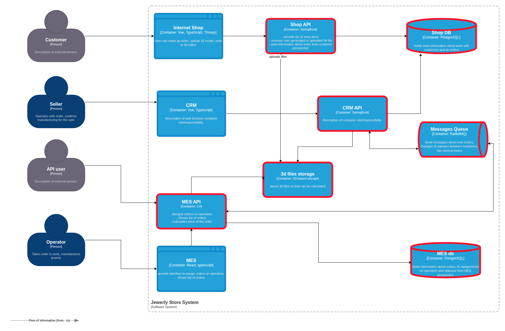
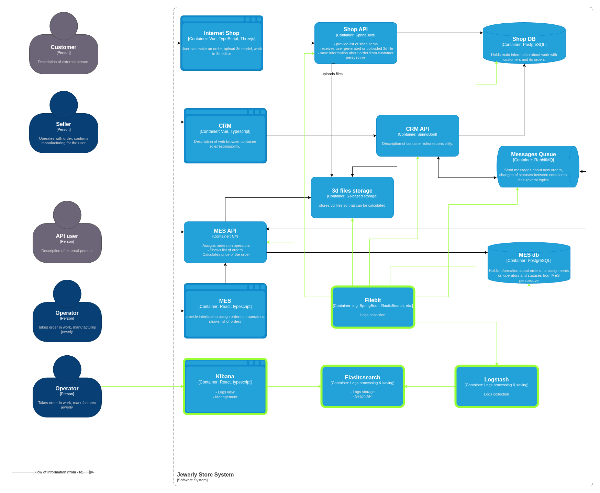

# Логирование

## Анализ системы и проектирование сбора логов

### Сервисы, включенные в централизованный сбор логов

Отмечены красной рамкой на диаграмме: 

### Список логов уровня INFO

Предполагается, что timestamp, trace_id и span_id выводятся в каждом логе.

| Сервис | Тип операции | Описание операции | Данные в логе |
|---|---|---|---|
| | | INITIATED | |
| Shop API     | HTTP POST    | Получен запрос на создание заказа                         | user_id, {order_details} |
| Shop API     | API call     | Создание заказа в Shop DB                                 | user_id, order_status |
| Shop DB      | SQL query    | INSERT-запрос в БД                                        | query_str, query_data |
| | | FILE_UPLOADED | |
| Shop API     | HTTP POST    | Загрузка/создание 3D-модели                               | user_id, order_id, order_status, model_3d_hash |
| Shop API     | API call     | Сохранение модели в S3                                    | order_id, order_status, model_3d_hash |
| S3           | I/O task     | Сохранение файла на диск                                  | file_id, bucket, file_hash |
| Shop API     | API call     | Изменение статуса заказа в БД                             | order_id, order_status |
| Shop DB      | SQL query    | UPDATE-запрос в БД                                        | query_str, query_data |
| | | PRICE_CALCULATED | |
| MES API      | CPU task     | Оценка заказа                                             | order_id, model_s3_id |
| MES API      | API call     | Создание заказа в MES DB                                  | order_id, model_s3_id, order_status |
| MES DB       | SQL query    | INSERT-запрос в БД                                        | query_str, query_data |
| MES API      | API call     | Сообщение об изменении статуса заказа в RMQ               | order_id, order_status |
| MessageQueue | RMQ message  | Передача сообщения об изменении статуса заказа            | rmq_msg_id, order_id, order_status |
| CRM API      | API call     | Изменение статуса заказа в БД                             | order_id, order_status |
| Shop DB      | SQL query    | UPDATE-запрос в БД                                        | query_str, query_data |
| | | MANUFACTURING_APPROVED | |
| CRM API      | HTTP PUT     | Получен запрос на подтверждение заказа продавцом          | order_id, order_status, seller_id |
| CRM API      | API call     | Изменение статуса заказа в БД                             | order_id, order_status, seller_id |
| Shop DB      | SQL query    | UPDATE-запрос в БД                                        | query_str, query_data |
| CRM API      | API call     | Передача сообщения об изменении статуса заказа            | order_id, order_status |
| MessageQueue | RMQ message  | Сообщение об изменении статуса заказа в RMQ               | rmq_msg_id, order_id, order_status   
| MES API      | API call     | Изменение статуса заказа в БД                             | order_id, order_status |
| MES DB       | SQL query    | UPDATE-запрос в БД                                        | query_str, query_data |
| | | MANUFACTURING_STARTED | |
| MES API      | HTTP PUT     | Получен запрос на взятие заказа в работу оператором       | order_id, order_status, operator_id |
| MES API      | API call     | Изменение статуса заказа в БД                             | order_id, order_status |
| MES DB       | SQL query    | UPDATE-запрос в БД                                        | query_str, query_data |
| MES API      | API call     | Сообщение об изменении статуса заказа в RMQ               | order_id, order_status |
| MessageQueue | RMQ message  | Передача сообщения об изменении статуса заказа оператором | rmq_msg_id, order_id, order_status |
| CRM API      | API call     | Изменение статуса заказа в БД                             | order_id, order_status, operator_id |
| Shop DB      | SQL query    | UPDATE-запрос в БД                                        | query_str, query_data |
| | | MANUFACTURING_COMPLETED | |
| MES API      | HTTP PUT     | Получен запрос на завершение заказа оператором            | order_id, order_status, operator_id |
| MES API      | API call     | Изменение статуса заказа в БД                             | order_id, order_status |
| MES DB       | SQL query    | UPDATE-запрос в БД                                        | query_str, query_data |
| MES API      | API call     | Сообщение об изменении статуса заказа в RMQ               | order_id, order_status |
| MessageQueue | RMQ message  | Передача сообщения об изменении статуса заказа оператором | rmq_msg_id, order_id, order_status |
| CRM API      | API call     | Изменение статуса заказа в БД                             | order_id, order_status, operator_id |
| Shop DB      | SQL query    | UPDATE-запрос в БД                                        | query_str, query_data |
| | | PACKAGING | |
| MES API      | HTTP PUT     | Получен запрос на упаковку заказа оператором              | order_id, order_status, operator_id |
| MES API      | API call     | Изменение статуса заказа в БД                             | order_id, order_status |
| MES DB       | SQL query    | UPDATE-запрос в БД                                        | query_str, query_data |
| MES API      | API call     | Сообщение об изменении статуса заказа в RMQ               | order_id, order_status |
| MessageQueue | RMQ message  | Передача сообщения об изменении статуса заказа оператором | rmq_msg_id, order_id, order_status |
| CRM API      | API call     | Изменение статуса заказа в БД                             | order_id, order_status, operator_id |
| Shop DB      | SQL query    | UPDATE-запрос в БД                                        | query_str, query_data |
| | | SHIPPED | |
| MES API      | HTTP PUT     | Получен запрос на отправку заказа покупателю              | order_id, order_status, operator_id |
| MES API      | API call     | Изменение статуса заказа в БД                             | order_id, order_status |
| MES DB       | SQL query    | UPDATE-запрос в БД                                        | query_str, query_data |
| MES API      | API call     | Сообщение об изменении статуса заказа в RMQ               | order_id, order_status |
| MessageQueue | RMQ message  | Передача сообщения об изменении статуса заказа оператором | rmq_msg_id, order_id, order_status |
| CRM API      | API call     | Изменение статуса заказа в БД                             | order_id, order_status, operator_id |
| Shop DB      | SQL query    | UPDATE-запрос в БД                                        | query_str, query_data |
| | | CLOSED | |
| CRM API      | HTTP PUT     | Получен запрос на закрытие заказа                         | order_id, order_status |
| Shop DB      | SQL query    | UPDATE-запрос в БД                                        | query_str, query_data |
| CRM API      | API call     | Сообщение об изменении статуса заказа в RMQ               | order_id, order_status |
| MessageQueue | RMQ message  | Передача сообщения об изменении статуса заказа            | rmq_msg_id, order_id, order_status |
| CRM API      | API call     | Изменение статуса заказа в БД                             | order_id, order_status |
| CRM DB       | SQL query    | UPDATE-запрос в БД                                        | order_id, order_status |

Комментарии

Большинство операций между сервисами нужно логировать в две фазы: старт, финиш (успех/провал).
Для краткости я свел это в одну запись. Например, "Сохранение заказа в БД" следует логировать в две фазы: "Попытка сохранения" -> "Успешное сохранение"/"Ошибка сохранения". В каждом случае данные для логирования будут немного отличаться. Например ошибка будет сопровождаться текстовым описанием и, возможно, стек трейсом, в то время как при успехе может быть выведен присвоенный идентификатор новой сущности.

### Другие уровни логирования

Я обязательно буду использовать другие уровни логирования:
- CRITICAL(FATAL) - ошибки, которые точно не пройдут незамеченными (падение сервиса или оборудования). Обязательно приложу к ним подробности (стек трейс, состояние системы).
- ERROR - ошибки в логике. Они не должны оказаться незамеченными. Приложу к ним описание состояния системы, стек трейс (опционально).
- WARN - подозрение на ошибочное состояние системы. Приложу к ним описание состояния системы.
- DEBUG/TRACE - отладочные сообщения. Их вывод может оставаться в коде системы, но отключен через параметры запуска на проде. Выводимые данные на усмотрение разработчика.

## Мотивация
В серьезных IT-системах с хорошо поставленным процессом контроля качества тоже случаются баги.
Как правило все просты ошибки уже были проработаны на стадиях анализа, разработки и тестирования.
Поэтому те, которые приходят из production-а часто выглядят фантастически и ставят в тупик, вызывая вопрос: "Как такое вообще возможно?".
Ответить на него позволяют логи. Они, подобно бортовым самописцам самолета, ведут непрерывную запись важных события системы.
По этим записям можно понять какие события происходили в системе и как это влияло на состояние её компонентов.

Какие проблемы компании помогут решить логи:
- установить точную причину того, почему клиенты жалуются на пропуск их заказов за счет возможности просматривать подробности этапов обработки заказа;
- быстрее исправлять ошибки, в том числе найденные на стадии тестирования благодаря наличию записей о состоянии системы, что значительно сократит задержки релизов.

Какие вероятные будущие проблемы поможет решить:
- быстрый разбор сбоев и инцидентов безопасности;
- оперативная реакция на сбои и инциденты безопасности.

Кроме того, система централизованного логирования позитивно повлияет на команду за счет:
- уменьшения времени на ручной сбор логов из разных компонентов системы;
- упрощения процесса анализа логов за счет единого формата и использования средств автоматизации;
- увеличения взаимопонимания между командами за счет большей прозрачности системы;
- улучшение процессов CI/CD за счет большей наблюдаемости системы.

Для аналитики и бизнеса есть плюсы, связанные с составлением аналитических отчетов:
- возможность увеличение скорости составления за счет использования автоматизации;
- повышение вероятности бизнес-инсайдов за счет большей наблюдаемости системы.

Пользователи тоже почувствую разницу:
- ошибок станет меньше;
- проблемы будут решаться быстрее;
- не придется месяцами ждать нужных фичей за счет уменьшения задержек релизов.

Метрики, на которые логи влияют позитивно:
- Бизнес
    - Успешно выполненных заказы (%) - за счет помощи в устранении имеющихся ошибок.
    - Time-to-market - за счет помощи в устранении ошибок в новых релизах.
    - DAU/MAU - за счет улучшения UX (меньше багов, быстрее реакция на обращения).
    - Время реакции на инцидент безопасности - за счет большей прозрачности системы.
- Технические
    - ErrorRate - за счет помощи в устранении имеющихся ошибок.
    - BugFixingTime - за счет увеличения прозрачности системы.

Стоит учитывать, что при реализации системы логирования нужно пройти по тонкой грани оптимальности между избыточностью и недостаточностью логов.
Первая ведет к перерасходу памяти на хранения и деградации производительности из-за затрат на ввод-вывод.
Вторая к бесполезности из-за невозможности восстановить контекст для решения проблемы.
В текущей реализации предлагается логировать важные операции бэкенд-сервисов так как именно в них происходит потеря заказов, долгие обработки запросов и расчет стоимости.
При этом пока предлагается не собирать логи:
- фронтов - пользователь и так увидит ошибку, если с него запрос не отправится, сейчас таких проблем нет (заказы создаются);
- GET-запросы (кроме MES API) так как сейчас с ними нет проблем.

Согласно заданию: "Команда не сможет реализовать единовременно логирование и трейсинг всех выделенных для этого систем.".
Выделим наиболее критичные компоненты для добавления логирования и трейсинга:
- Shop API - стартовая точка, источник знаний о том, за чем следить.
- MES API - важная часть, в которой проходит много операций с заказом.
- CRM API - участвует в работе над заказом, без неё не будут выполнены определенные этапы.
В итоге предлагается отказаться от логирования и трейсинга инфраструктурных сервисов (БД, RMQ, S3).
Отсутствие логов и трейсов из этих сервисов может быть компенсировано чуть более сложным анализом вышеперечисленных критичных компонентов.

## Предлагаемое решение

Для внедрения предлагается стек ELK в такой конфигурации:
- Filebeat - сбор уже существующих в системе логов из соответствующих файлов.
- Logstash - форматирование и сохранение логов в хранилище.
- Elastic search - предоставление поискового сервиса.
- Kibana - визуализация поисковых запросов и управление.

**Безопасность**
- Работа с чувствительными данными будет осуществляться по следующим принципам:
    - не логировать чувствительные данные без причины;
    - при необходимости логировать чувствительные данные, делать это в неявном виде: маска(***), хэш или факт наличие (yes/no);
    - проводить обучение сотрудников;
    - сроки хранения логов с чувствительной информацией должны быть минимальными и соответствовать действующему законодательству.
    - считать необоснованно открытые данные в логах критичным багом, требующим немедленного устранения;
    - проводить регулярный аудит логов.
- Доступ к системе логирования (UI, API) будет организован через SSO на основе OIDC.
- Доступ к системе только по HTTPS (TLS >= 1.2).
- Авторизоваться в системе смогут пользователи, имеющие определенные роли, допущенные принятой в компании RBAC.
- RBAC будет разделять цели доступа:
    - наполнение данными: запись логов в процессе работы сервисов;
    - использование данных: чтение логов и конфигураций (разработчики, тестировщики, аналитики, менеджмент);
    - настройка структуры: чтение и запись конфигураций (devops, безопасность).
- Сетевые политики. Доступ к данным только из корпоративной сети или VPN.
- Аудит активности: логирование основных событий (попытки авторизации, просмотр логов, экспорт).
- Логи будут храниться в зашифрованном виде на диске.
- Проводится регулярное обновление компонентов системы логирования.

**Политика хранения**

Логи сохраняются в индексы с разделением по сервисам, за исключением security.
В таблице ниже указаны настройки переходов между фазами хранение:
- Hot phase:
    - наполнение данными;
    - ролловер при выходе за лимиты;
    - доступ на запись и чтение;
    - хранилище с высокой скоростью доступа (SSD).
- Warm phase:
    - данные доступны для активного просмотра, запись ведется в новый индекс;
    - доступ лишь на чтение;
    - высокоскоростное хранилище (SSD).
- Cold phase:
    - доступ к данным открыт, но не ожидается большого интереса;
    - доступ лишь на чтение;
    - дешевое хранилище (HDD).

| Шаблон индекса | Шарды | Реплики | Hot phase | Warm phase | Cold phase |
|---|---|---|---|---|---|
| Логи Shop API      | 5 | 1 + 1 | 7 дней  | 30 дней | 1 год    |
| Логи Shop DB       | 5 | 1 + 1 | 7 дней  | 30 дней | 1 год    |
| Логи S3            | 5 | 1 + 1 | 7 дней  | 15 дней | 2 месяца |
| Логи MES API       | 5 | 1 + 1 | 7 дней  | 30 дней | 1 год    |
| Логи MES DB        | 5 | 1 + 1 | 7 дней  | 15 дней | 2 месяца |
| Логи Message Queue | 5 | 1 + 1 | 7 дней  | 15 дней | 2 месяца |
| Логи CRM API       | 5 | 1 + 1 | 7 дней  | 30 дней | 1 год    |
| Логи Security      | 5 | 1 + 1 | 30 дней | 1 год   | 3 года   |

Количество шардов - значение по умолчанию, обеспечивающее баланс между скоростью поиска и индексацией данных.  
Количество реплик - 1 primary + 1 replica - минимальное значение, для защиты от аварийной потери данных.  
Бизнес-логика (API-сервисы) - храним логи в соответствии с жизненными циклами продукта (релизы, сезонность)  
Инфраструктурные сервисы (БД, S3, RMQ) - храним, пока вероятность обнаружения ошибок достаточно велика.  
Логи безопасности - храним долго в соответствии с законодательством.  

## Анализ логов

Основные алерты планируется сделать по метрикам, но некоторые специфичные по логам необходимы.  
Алерты по аномалиям:
- Бизнес-ошибка при обработке заказа (пока нет штатного процесса отмены и соответствующих статусов).
- Ошибка коннекта к БД, RMQ, S3 (>10 раз подряд).
- Неоднократные неудачные попытки входа в систему (>10 раз подряд). 
- Критичные ошибки инфраструктуры (OutOfMemory, NullPointerException, segfault и другие).
